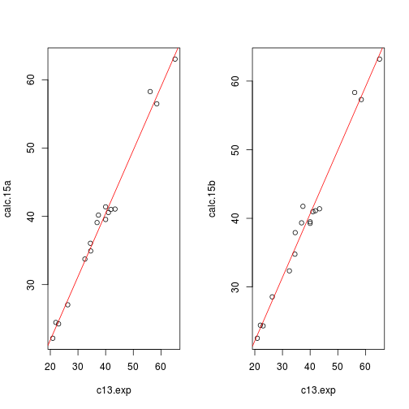

What follows is a reproduction of some of the calculations described in, _"Assigning Stereochemistry to Single Diastereoisomers by GIAO NMR Calculation: The DP4 Probability"_[DOI:10.1021/ja105035r](http://pubs.acs.org/doi/abs/10.1021/ja105035r).  
* It is assumed that the reader has access to the paper, and he has read and understood it.  

### Table 2

The data necessary to illustrate the calculations are found in **Table 2** but before anyone can do anything with this data it has to be scraped from the pdf file and _munged_.  

### Scraping and Munging Table 2 on p129593

The pdf file was opened and using the mouse the table was highlighted from the lower bottom left to the top upper right, this data was copied and pasted into table2.txt.  The <sup>13</sup>C exp column did not highlight in this procedure and hence wasn't copied during this procedure and so this was copied, pasted and saved in a separate process as, raw.c13.exp.txt and eventually rendered as column c13.exp (see later).  
With these two files in hand, the table was re-built as a dataframe in R using the following commands,  

```r
raw.table2  <- read.csv("table2.txt",stringsAsFactors=FALSE)
raw.c13.exp  <- read.csv("raw.c13.exp.txt",stringsAsFactors=FALSE)

position  <- seq(1,17,1)
calc.15a  <- as.numeric(raw.table2[seq(8,58,3),1])
calc.15b  <- as.numeric(raw.table2[seq(9,59,3),1])
c13.exp  <- as.numeric(raw.c13.exp[,1])
scaled.15a  <- as.numeric(raw.table2[seq(61,76,1),1])
scaled.15a[17]  <- as.numeric(strsplit(raw.table2[77,1]," ")[[1]][1])
scaled.15b  <- as.numeric(rep(NA,17))
scaled.15b[1]  <- as.numeric(strsplit(raw.table2[77,1]," ")[[1]][2])
scaled.15b[2:16]  <- as.numeric(raw.table2[c(78:92),1])
scaled.15b[17]  <- as.numeric(strsplit(raw.table2[93,1], " ")[[1]][1])
corr.15a  <- as.numeric(rep(NA,17))
corr.15a[1]  <- as.numeric(strsplit(raw.table2[93,1]," ")[[1]][2])
corr.15a[2:16]  <- as.numeric(raw.table2[c(94:108),1])
corr.15a[17]  <- as.numeric(strsplit(raw.table2[109,1]," ")[[1]][1])
corr.15b  <- as.numeric(rep(NA,17))
corr.15b[1]  <- as.numeric(strsplit(raw.table2[109,1]," ")[[1]][2])
corr.15b[2:16]  <- as.numeric(raw.table2[c(110:124),1])
corr.15b[17]  <- as.numeric(strsplit(raw.table2[125,1]," ")[[1]][1])
prob.15a  <- as.numeric(rep(NA,17))
prob.15a[1]  <- as.numeric(strsplit(raw.table2[125,1]," ")[[1]][2])
prob.15a[2:17]  <- as.numeric(raw.table2[126:141,1])
prob.15b  <- as.numeric(rep(NA,17))
prob.15b[1]  <- as.numeric(strsplit(raw.table2[143,1]," ")[[1]][2])
prob.15b[2:17]  <- as.numeric(raw.table2[144:159,1])

table2  <- data.frame(position,calc.15a,calc.15b,c13.exp,scaled.15a,scaled.15b,corr.15a,corr.15b,prob.15a,prob.15b)
```
Bear in mind that the scraping procedure may be different if done by someone else but the two text files are included as part of this repository.  
This table can be inspected and compared to the original pdf table: see below,

```r
table2
```

```
##    position calc.15a calc.15b c13.exp scaled.15a scaled.15b corr.15a
## 1         1    40.56    40.97    41.0      40.62      40.38    -0.38
## 2         2    27.05    28.56    26.3      24.75      24.49    -1.55
## 3         3    22.15    22.53    20.9      18.93      18.65    -1.97
## 4         4    34.93    37.92    34.6      33.71      33.46    -0.89
## 5         5    58.27    58.34    56.1      56.91      56.70     0.81
## 6         6    41.39    39.27    40.0      39.54      39.30    -0.46
## 7         7    36.06    34.78    34.5      33.60      33.35    -0.90
## 8         8    41.01    41.11    41.9      41.59      41.35    -0.31
## 9         9    56.48    57.31    58.5      59.50      59.29     1.00
## 10       10    40.18    41.75    37.4      36.73      36.49    -0.67
## 11       11    33.74    32.35    32.5      31.44      31.19    -1.06
## 12       12    39.09    39.35    36.9      36.19      35.95    -0.71
## 13       13    63.03    63.21    65.1      66.62      66.43     1.52
## 14       14    39.54    39.50    40.0      39.54      39.30    -0.46
## 15       15    24.46    24.43    22.0      20.11      19.84    -1.89
## 16       16    24.25    24.33    23.0      21.19      20.92    -1.81
## 17       17    41.07    41.39    43.4      43.21      42.97    -0.19
##    corr.15b prob.15a prob.15b
## 1     -0.62     0.44     0.40
## 2     -1.81     0.26     0.22
## 3     -2.25     0.21     0.18
## 4     -1.14     0.35     0.32
## 5      0.60     0.37     0.40
## 6     -0.70     0.42     0.38
## 7     -1.15     0.35     0.31
## 8     -0.55     0.45     0.41
## 9      0.79     0.34     0.37
## 10    -0.91     0.39     0.35
## 11    -1.31     0.33     0.29
## 12    -0.95     0.38     0.34
## 13     1.33     0.26     0.29
## 14    -0.70     0.42     0.38
## 15    -2.16     0.22     0.18
## 16    -2.08     0.22     0.19
## 17    -0.43     0.47     0.43
```

### Columns calc.15a, calc.15b, and c13.exp

The authors of the paper have chosen compounds **15a** and **15b** (see original paper's [supplemental details](http://pubs.acs.org/doi/suppl/10.1021/ja105035r/suppl_file/ja105035r_si_001.pdf) for details of the structures) to illustrate the calculation.  The carbon-13 chemical shifts of the two proposed structures were calculated and reported as was the carbon-13 chemical shifts (of compound 15a). 

   

### Scaled Shifts: columns scaled.15a and scaled.15b _vs_ Scaled.15a and Scaled.15b

The calculated shifts are empirically scaled by finding the least squares fit parameters (slope and intersept) from the relation between the calculated chemical shift and the empirical chemical shift (the calculated values on the _y_-axis and the empirical values on the _x_-axis).  Once these values have been found the scaled values are given by subtracting the intercept from the corresponding calculated value and dividing everything by the slope.  

This was done with the following R-code,


```r
fit.15a  <- lm(calc.15a ~ c13.exp, data=table2)
fit.15b  <- lm(calc.15b ~ c13.exp, data=table2)

opar <- par(mfrow=c(1,2))
plot(calc.15a ~ c13.exp, data=table2)
abline(fit.15a,col="red")
plot(calc.15b ~ c13.exp, data=table2)
abline(fit.15b,col="red")
```

 

```r
par(opar)

d.calc  <- function(x,y,z) {a  <- (x - y)/z
                 # x = calc; y = intercept; z = slope
                 return(a)}
Scaled.15a  <- d.calc(table2$calc.15a,fit.15a$coefficients[[1]],fit.15a$coefficients[[2]])
Scaled.15b  <- d.calc(table2$calc.15b,fit.15b$coefficients[[1]],fit.15b$coefficients[[2]])
```
Of concern is that scaled.15a and Scaled.15a (the one from the paper the other generated by the R-code) are not the same - at the moment it is thought that this is a consequence of rounding errors.  

With the scaled results in hand the errors of the two possible assignments are calculated by subtracting the calculated chemical shift from its corresponding scaled chemical shift, this was done in R as follows,


```r
Corr.15a  <- Scaled.15a - calc.15a
Corr.15b  <- Scaled.15b - calc.15b
```

The errors were then used to find the probabilities of these errors occuring with the following R-code,


```r
prob  <- function(x,sigma=2.306,nu=11.38) {
     y  <- 1-pt((abs(x)/sigma),nu)
     return(y)
}

Prob.15a  <- prob(Corr.15a)
Prob.15b  <- prob(Corr.15b)
```

The products of these probabilities can be summed and the percentage of each of the products within the sum gives the DP4 value.  This is given by the R-code,


```r
100*prod(Prob.15a)/(prod(Prob.15a)+prod(Prob.15b))
```

```
## [1] 77.91
```

```r
100*prod(Prob.15b)/(prod(Prob.15a)+prod(Prob.15b))
```

```
## [1] 22.09
```

These values compare favourably with those reported in the paper, 77.9 _vs_ 79.5%.  

### Discrepancies

*The scaled chemical shifts reported in Table 2 and those calculated don't match and hence nor do the subsequent columns in the table.
*The results reported and calculated are not the same (but very close).
*The corrected errors within the table do not tally.

Code for producing data to be tested in the [applet](http://www-jmg.ch.cam.ac.uk/tools/nmr/DP4/),

```{r}
paste0("C",table2[,1],collapse=",")
paste0(table2[,2],collapse=",")
paste0(table2[,3]),collapse=",")

paste(table2[,4],collapse=",","(",paste0("C",table2[,1]),")",sep="")
```

*The output from the applet does not tally with that reported in the paper (nor the calculation).
